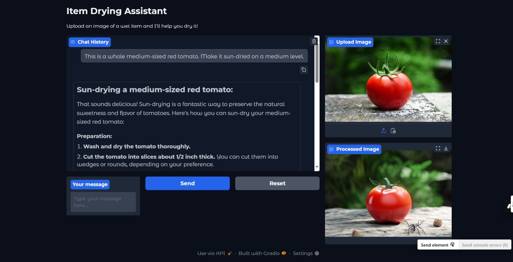

# Drying Assistant

An AI-powered assistant that helps you understand how to dry different items and shows you what they would look like when dry. Built with Gradio and powered by LangChain and Stability AI.

## Features

- 🤖 Intelligent chat interface for asking questions about drying items
- 🖼️ Image upload and processing to show dried appearance
- 🎨 Realistic image transformation using Stability AI API
- 💬 Context-aware conversations with memory
- 🎯 User-friendly interface with Gradio
- 🔄 Real-time image processing
- 📱 Responsive design for all devices
- 🐳 Docker support for easy deployment

## Live Demo: https://drying-assistant.onrender.com



*The Drying Assistant web interface showing the chat and image processing capabilities.*

## Prerequisites

- Python 3.8 or higher
- OpenRouter API key
- Stability AI API key
- Docker and Docker Compose (optional, for containerized deployment)
- Virtual environment (for local development)

## Deployment Options

### 1. Docker Deployment (Recommended)

1. Clone the repository:
```bash
git clone https://github.com/djpapzin/agent-all-dry.git
cd agent-all-dry
```

2. Set up environment variables:
```bash
cp .env.example .env
# Edit .env and add your API keys
```

3. Build and run with Docker Compose:
```bash
docker-compose up -d
```

The application will be available at `http://localhost:7860`

To stop the application:
```bash
docker-compose down
```

### 2. Local Development Setup

1. Clone the repository:
```bash
git clone https://github.com/djpapzin/agent-all-dry.git
cd agent-all-dry
```

2. Create and activate a virtual environment:
```bash
# Windows
python -m venv venv
.\venv\Scripts\activate

# Linux/MacOS
python -m venv venv
source venv/bin/activate
```

3. Install dependencies:
```bash
pip install -r requirements.txt
```

4. Set up environment variables:
```bash
cp .env.example .env
# Edit .env and add your API keys
```

5. Run the application:
```bash
python -m src.app
```

The application will be available at `http://localhost:7860`

## Project Structure
```
.
├── src/                # Source code directory
│   ├── __init__.py
│   ├── app.py         # Main application
│   ├── drying_agent.py  # Drying agent implementation
│   └── image_dryer.py   # Image drying implementation
├── test_images/       # Sample images for testing
│   ├── kitten.jpg
│   └── tomato.jpg
├── .env.example       # Environment variables template
├── .gitignore        # Git ignore file
├── docker-compose.yml # Docker compose configuration
├── Dockerfile        # Docker configuration
├── requirements.txt  # Project dependencies
├── setup.py         # Python package configuration
├── LICENSE          # MIT License file
└── README.md        # Documentation
```

## Installation Options

### 1. Using Docker (Recommended)
Follow the Docker deployment instructions above.

### 2. Using pip and setup.py
```bash
# Install in development mode
pip install -e .

# Install in production mode
pip install .
```

## Test Images

The repository includes sample images in the `test_images` directory that you can use to test the application:

1. Tomato Image:
   - File: `test_images/tomato.jpg`
   - Try prompt: "This is a whole medium-sized red tomato. Make it sun-dried on a medium level."

2. Kitten Image:
   - File: `test_images/kitten.jpg`
   - Try prompt: "This is a tiny kitten. Please dry it and make it completely dehydrated."

Feel free to experiment with your own images and prompts!

## Dependencies

Core dependencies (as defined in setup.py):
- langchain>=0.1.0: For AI conversation handling
- langchain-community>=0.0.10: For community extensions
- openai>=1.0.0: For OpenAI API integration
- gradio>=4.0.0: For the web interface
- diffusers>=0.24.0: For image processing
- python-dotenv>=1.0.0: For environment variable management
- pillow>=10.0.0: For image processing
- torch>=2.0.0: For machine learning operations
- transformers>=4.30.0: For AI model handling

Development dependencies:
- pytest>=7.0.0: For testing
- black>=23.0.0: For code formatting
- flake8>=6.0.0: For code linting
- isort>=5.12.0: For import sorting

## License

This project is licensed under the [MIT License](LICENSE) - see the LICENSE file for details.

## Author

DJ Papzin (L.fanampe@gmail.com) 